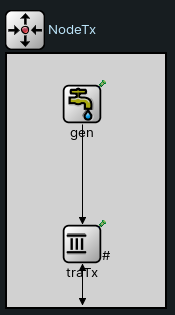

# Tarea de Diseño

En la segunda parte de este proyecto, el objetivo que se tiene es la re-estructuración de la red para la implementación de un algoritmo de control de flujo y congestión que nos permita poder comparar mediante un análisis los resultados de _intentar resolver los problemas_ vs _no hacer nada_.

## Estructura de la red ([`network.ned`](network.ned))

La nueva estructura de la red agrega dos elementos importantísimos que se "derivan" de la `Queue` (i.e., son parecidos en cierto aspecto). La idea es crear elementos que sean los buffers de input y output de los módulos de generación (`NodeTx`) y de recepción (`NodeRx`). Estos elementos son llamados `TransportTx` y `TransportRx`.
El diagrama de los módulos `NodeTx` y `NodeRx` queda dado por las siguientes estructuras:

 

Esto nos permite poder crear en la red un canal de retorno desde el nodo de recepción al nodo de generación, brindando la posibilidad de que el receptor lo use para poder enviar mensajes de control al emisor.
La estructura final que se logra es la siguiente:


## Constantes de la red ([`omnetpp.ini`](omnetpp.ini))

Dada la nueva estructuración de la red, se consideran las siguientes constantes:

```cpp
[General]

# System parameters

network = Network
sim-time-limit = 200s

Network.nodeTx.gen.generationInterval = exponential(0.1)
Network.nodeTx.gen.packetByteSize = 12500

Network.queue0.bufferSize = 100
Network.queue1.bufferSize = 200

Network.nodeTx.traTx.bufferSize = 20000000
Network.nodeRx.traRx.bufferSize = 200
```

Lo principal para tener en cuenta es que `Network.queue0.bufferSize` se considera `100` por recomendación de los profesores (en el enunciado del proyecto) para un mejor análisis en conjunto de los problemas de flujo y congestión.

## Nuevo tipo de mensaje ([`ControlPacket.msg`](ControlPacket.msg))

Al agregar un nuevo canal de retorno por el cual enviar mensajes, se torna importantísimo generar un nuevo tipo de paquete, el cual sea de control y permita almacenar datos que el receptor llena para que sean leídos e interpretados por el emisor para realizar alguna acción.
Para ello mismo, se hace uso del archivo [`ControlPacket.msg`](ControlPacket.msg).

En este archivo se crea un nuevo tipo de paquete llamado `ControlPacket`, el cual contiene los datos de:

- `totalBuffer`: tamaño total del buffer del receptor

- `remainingBuffer`: capacidad restante del buffer del receptor

- `timeElapsedToReceivePacket`: cantidad de tiempo que transcurrió entre el envío y la recepción del correspondiente paquete de datos (se explica más a detalle en la sección de _Algoritmo_)

El Framework Omnet++ se encarga automáticamente, al compilar, de crear el .h y .cc correspondientes a este nuevo tipo de paquete, creando su nueva clase que deriva de `cPacket`.

## Idea de los elementos de transporte ([`TransportTx`](TransportTx.cc) y [`TransportRx`](TransportRx.cc))

### TransportTx

Este elemento es el encargado de:

1. Recepción de paquetes de datos desde `Gen` y su envío a `Queue0`

2. Recepción de paquetes de control desde `Queue1` y gestión de acciones que modifiquen los tiempos de (1.) para evitar problemas de flujo y congestión (y, por ende, pérdida de paquetes)

### TransportRx

Este elemento es el encargado de:

1. Recepción de paquetes de datos desde `Queue0` y su envío a `Sink`

2. Creación de paquetes de control (uno por cada paquete de dato agregado al buffer) y su envío a `Queue1` con destino a `TransportTx`

## Métricas que se gestionan en los distintos módulos

- `packetsTransmitted`: cantidad de paquetes que se transmitieron desde el módulo correspondiente. Se encuentra en

    - `Network.nodeTx.gen`

    - `Network.nodeTx.traTx`

- `bufferSize`: tamaño del buffer de paquetes de datos en el módulo correspondiente. Se encuentra en

    - `Network.nodeTx.traTx`

    - `Network.queue0`

    - `Network.nodeRx.traRx`

    - `Network.queue1`

- `packetsReceived`: cantidad de paquetes de datos recibidos en el módulo correspondiente. Se encuentra en

    - `Network.nodeRx.traRx`

    - `Network.nodeRx.sink`

- `controlPacketSent`: cantidad de paquetes de control enviados en el módulo correspondiente. Se encuentra en

    - `Network.nodeRx.traRx`

- `controlPacketReceived`: cantidad de paquetes de control recibidos en el módulo correspondiente. Se encuentra en

    - `Network.nodeTx.traTx`

- `Delay`: cantidad de paquetes que llegaron a destino. Se encuentra, por ende, en

    - `Network.nodeRx.sink`

- `packetsDropped`: cantidad de paquetes que se perdieron en el módulo. Se encuentra en

    - `Network.nodeTx.traTx`

    - `Network.queue0`

    - `Network.nodeRx.traRx`

    - `Network.queue1`

## Algoritmo sencillo de control de flujo y congestión

Este algoritmo sólo se implementa en secciones específicas de [`TransportTx`](TransportTx.cc) (en `handleControl`) y [`TransportRx`](TransportRx.cc) (en `addControlPacket`).

Se hacen las siguientes consideraciones:

- Por cada paquete recibido en `TransportRx` y aceptado (es decir, que no se elimina), se crea su correspondiente mensaje de control, el cual contiene la información de: tamaño actual del buffer, capacidad restante del buffer y total de tiempo que el paquete estuvo en la red desde que salió del emisor hasta que llegó al receptor.

- En `TransportTx` se recibe la información de control mediante estos paquetes que le llegan desde la `Queue1` y se considera lo siguiente:

    - Vamos a tener una variable `minSend` que contenga el tiempo mínimo que tardó un mensaje en llegar al receptor (según la información que nos llega por los paquetes de control)
    
        - Esto nos permite darnos una idea de la congestión de la red y actuar en base a eso

        - Se "resetea" cada 50 paquetes de control recibidos para mantener actualizada la información (porque capaz no está congestionada la red pero tiene más carga que antes)
    
    - Vamos a tener una variable `controlFactor` que es la responsable del manejo del control de flujo y congestión. Es un valor entre `0` y `1`, el cual se aplica a toda generación de evento de un envío de paquete de datos del siguiente modo:
        ```cpp
        void TransportTx::scheduleSendPacketWithDelay(simtime_t delay) {
            scheduleAt(simTime() + delay + delay*controlFactor, endServiceEvent);
        }
        ```
    
    - Respecto al **flujo** se considera lo siguiente:

        - Si `remainingBuffer >= 0.70*totalBuffer`, entonces se aumenta `controlFactor` en `1e-2` para demorar la salida de paquetes (porque el receptor se esta quedando sin espacio)

        - Si `remainingBuffer <= 0.40*totalBuffer`, entonces se disminuye `controlFactor` en `1e-2` para acelerar la salida de paquetes (porque el receptor tiene espacio)

    - Respecto a la **congestión** se considera lo siguiente:

        - Si `timeElapsedToReceivePacket >= 2*minSend`, entonces se aumenta `controlFactor` en `1e-2` para demorar la salida de paquetes (porque hay mucha más congestión que la registrada en este registro de 50 paquetes)

        - Si `timeElapsedToReceivePacket <= minSend`, ntonces se disminuye `controlFactor` en `1e-2` para acelerar la salida de paquetes (porque tiene menos carga la red que la registrada anteriormente). Además, se actualiza el valor de `minSend`.

## Análisis de los casos de estudio

**PARTE DE FACU**