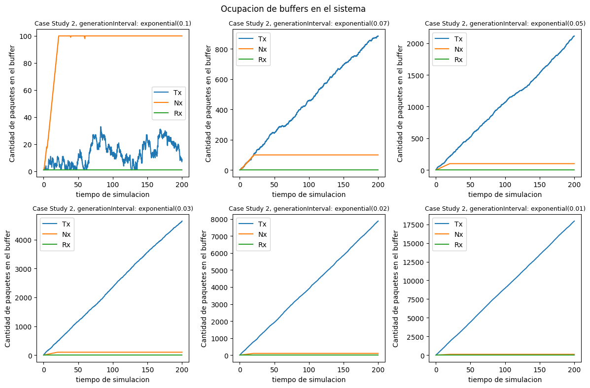
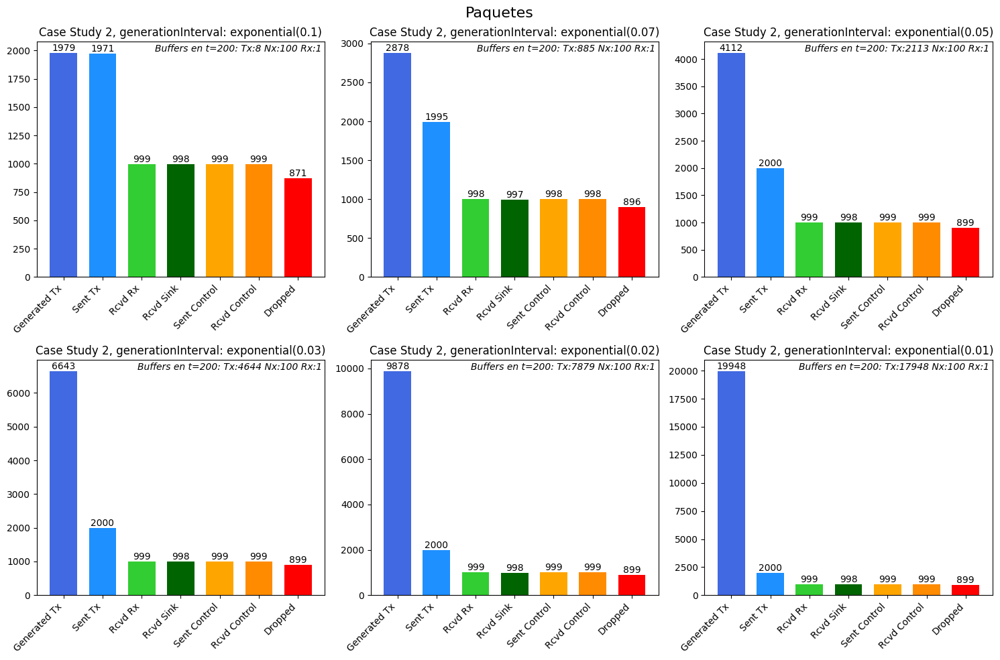

# Análisis del Flujo y la Congestión de una Red Simulada en Omnet++

# Resumen

En este laboratorio nos adentramos en la simulación de modelos de red en Omnet++, y el análisis de trafico de las respectivas redes bajo condiciones particulares. Nos centramos en dos tareas principales: Análisis y Diseño, en las que analizamos la respuesta de una red ante la introducción de tasas de transmisión y demás parámetros, y diseñamos un control de flujo y congestión para administrar los datos transportados por la red de forma ordenada.

# Introducción

En una red, principalmente en la capa de transporte, hay varios factores que pueden alterar al desempeño de la misma a la hora de enviar y recibir datos. Entre algunos de esos factores, encontraremos los relacionados al flujo y a la congestión de la red.

En particular, en este proyecto, nos centraremos en esos dos conceptos y simularemos primero, el comportamiento de una red cuando distintos parámetros vinculados al tráfico de la red se manipulan, y luego veremos cómo cambia su comportamiento cuando se emplea un control de flujo y de congestión particular.

Primero que nada, debemos dejar en claro la diferencia principal entre control de flujo y congestion:

- El control de flujo es un control del tráfico de datos entre un emisor y un receptor, para asegurar que el receptor **no esté recibiendo** una cantidad abrumadora de datos por parte del emisor. Esto lo hace a través de métodos que limitan y reducen los datos enviados por parte del emisor, como por ejemplo, el uso de buffers por parte de los receptores, en donde el emisor no puede enviar datos si el receptor no tiene buffers o “espacio” disponibles para almacenarlos.
- El control de congestión es un control que se utiliza para regular la cantidad de datos que son **enviados por la red en sí**, debido a que puede producirse un envío masivo para una capacidad de transferencia de la red limitada. No se centra en la cantidad que puede recibir un receptor, si no **en la cantidad que puede aguantar la red cuando transfiera esos datos**.

En conclusión, el control de congestión **regula el tráfico que circula por la red en sí**, mientras que el control de flujo regula el **tráfico recibido por un receptor.**

En este proyecto, en particular trabajamos con una simulación discreta del comportamiento de una red usando Omnet++. Esto quiere decir que gracias a la interfaz de Omnet++, podemos analizar el comportamiento de una red a través de una simulación de tiempo continuo y discreto (no necesariamente real) a un costo muy bajo, teniendo paso por paso cómo los datos se mueven a través de la red, pudiendo ver el efecto de distintos eventos en la misma de forma clara y directa. Este tipo de simulación nos es muy útil para poder modelar los controles de flujo y congestión.

## Análisis de Casos

En la parte de Análisis fue que nosotros, mediante un modelo de red de colas proporcionado por la cátedra, analizamos el comportamiento del tráfico de la red luego de agregar nociones de capacidad como lo es la **tasa de transferencia de datos** y la **memoria del buffer** usando. Para ello, actualizamos el módulo `network.ned` de forma tal que existieran dos compuestos llamados `nodeTx` y `nodeRx` encargados de intervenir en la transferencia de datos y de limitar la transmisión utilizando un buffer y tasas de transferencia. También se utilizó cPacket para simular los objetos de transferencia, con su respectivo tamaño en bytes, y se modificó el archivo `omnetpp.ini` para introducir nuevos parámetros como el tamaño máximo de los buffers:

- Buffer de NodeTx: almacena los paquetes que vienen de Gen y van hacia Queue. Su tamaño será arbitrario y será de 2000000.
- Buffer Queue: almacena los paquetes que van desde NodeTx a NodeRx. Tendrá un tamaño de 200.
- Buffer NodeRx: almacena los paquetes que vienen de Queue y van hacia Sink. Tendrá un tamaño de 200.

A partir de estas modificaciones, analizamos dos casos de estudio, simulando distintas situaciones con los siguientes parámetros:

### Primer Caso

1. NodeTx a Queue: tasa de transferencia de 1 Mbps y demora de transmisión de 100 us.
2. Queue a NodeRx: tasa de transferencia de 1 Mbps y demora de transmisión de 100 us.
3. Queue a Sink: tasa de transferencia de 0.5 Mbps

Notemos que en este primer caso, la tasa de transferencia a Queue es mayor a la tasa de transferencia de Queue a Sink, significa que va a haber más paquetes entrantes a Queue que paquetes salientes. Ésto nos da una idea de qué podría pasar si se envían muchos paquetes por medio de la red: si el intervalo de generación es pequeño, el buffer de NodeRx probablemente se saturará, debido a que se reciben más paquetes de los que entregan, por lo tanto, los paquetes que lleguen, serán ingresados al buffer hasta que puedan enviarse. La razón por la que se reciben muchos paquetes es porque la tasa de transferencia es mayor. 

Debajo, tendremos unos gráficos que representan la saturación de los buffers con distintas velocidades de envío de paquetes. 

**Saturación de Buffers**

Los siguientes gráficos muestran la relación entre la cantidad de paquetes en los buffers en cierto tiempo de simulación.

Si vemos los gráficos de izquierda a derecha, siendo el primer gráfico el de la primera fila y el último el tercero de la segunda fila, observamos cómo se llenan los buffers a medida que se aumenta el tiempo que hay entre la generación de los paquetes. 


En la primera imagen, se genera un paquete relativamente rápido, ésto significa que:

- Debido a que la tasa de transferencia del NodoTx es mayor a la del NodoRx, el buffer de de NodoRx se llenará rápido porque el paquete llegará rápido, saturando al buffer hasta llegar a su límite de paquetes (200 como máximo). También, veremos que el buffer de NodoTx también se irá llenando progresivamente, porque los paquetes ya no pueden ingresar al buffer de NodoRx, por lo que deben esperar a que un lugar se desocupe y quedarse donde estén. Cabe destacar que el buffer de NodoRx se llenará mucho más rápido que el de NodoTx (los paquetes entran y salen de NodoTx en la misma velocidad)

Luego, si el intervalo de generación aumenta, veremos que el buffer de NodoRx también se irá llenando en mayor cantidad que el buffer de NodoRx, pero tardará un poquito más en hacerlo. Por ejemplo, en la segunda imagen tenemos:

- Como el intervalo aumentó, se generan menos paquetes, por lo que habrá una disminución de paquetes que transitan la red. Aún así, al haber menor tasa de transferencia entre NodoRx y Queue, se identificará una pequeña saturación del buffer de NodoRx por la misma razón que en la imagen anterior, con la diferencia de que como tardan más en generarse los paquetes, tardará más en ocuparse el buffer. Aquí también veremos que el buffer de NodoRx se llenará más rápido que el de NodoTx.

Este análisis se repite a medida que vamos aumentando más el tamaño del intervalo de generación. Si observamos las últimas imágenes, veremos que la transmisión de paquetes es casi pareja en todas las conexiones. Ésto es porque la cantidad de paquetes enviados es muy pequeña (caso de la última imagen).

**Pérdida de Paquetes**

Veamos cómo afectan estas tasas de transferencia en la pérdida de paquetes. Normalmente, uno espera que si un buffer se satura con muchos paquetes, algunos terminarán perdiéndose, porque no llegarían a destino. Veamos en nuestros gráficos qué pasa:

- En el primer caso, como vimos anteriormente, los paquetes se generan rápidamente, produciendo un gran movimiento en la red. Debido a que NodoRx es más lento en enviar los paquetes que le llegan, se pierden algunos en el camino (770 en total).
- A medida que se va aumentando el intervalo de generación, vemos cómo dejan de perderse paquetes, ya que el cambio en el intervalo compensa la diferencia entre las tasas de transferencia de los nodos.


### Segundo Caso

1. NodeTx a Queue: tasa de transferencia de 1 Mbps y demora de transmisión de 100 us.
2. Queue a NodeRx: tasa de transferencia de 0.5 Mbps y demora de transmisión de 100 us.
3. Queue a Sink: tasa de transferencia de 1 Mbps

Aquí veamos que también existe una tasa de transferencia menor a las demás. En particular, los paquetes de Queue a NodoRx, se enviarán más lento que en otras conexiones de la red, significando que allí los paquetes se congestionarán, porque los mismos llegarán a una velocidad mayor. Además, debido a que los paquetes de Queue a NodeRx llegan más lento, tendremos que de Queue a Sink saldrán menos paquetes. Esto nos da una idea de que pasará algo similar al caso 1. Veamos los gráficos que obtuvimos:

**Saturación de Buffers**


Efectivamente, no hay muchas diferencias entre los gráficos del caso 1 y del caso 2. Ambos casos tienen una conexión con una tasa de transferencia menor a las demás, produciendo que la congestión de la red cambie y aumente.

**Pérdida de Paquetes**

Veamos ahora cómo se registraron las pérdidas:


Nuevamente, tenemos gráficos similares al caso 1.

**Preguntas importantes**

1. ¿Qué diferencia observa entre el caso de estudio 1 y 2? 
    
    La diferencia que es que en el caso 1, el “control” que se realiza es de flujo. Esto se debe a que la tasa de transferencia hacia Sink es menor a las demás tasas, es decir, la red es una red veloz que alimenta a un “receptor” de baja “capacidad”; A Sink llegan paquetes en una velocidad menor, por lo tanto llega poca cantidad de paquetes, resultando en una “menor capacidad”.
    
    En cambio, en el caso 2 tenemos un control de congestión. Ésto quiere decir que no es puntualmente la cantidad de paquetes que llegan a destino (Sink) el factor que limita el funcionamiento de la red, si no que la capacidad interna de la red se ve afectada por la baja tasa de transferencia de Queue a NodeRx.
    
2. ¿Cuál es la fuente limitante en cada uno? 
    - En el caso 1: la cantidad de paquetes que llegan a Sink.
    - En el caso 2: la cantidad de paquetes que pueden ser transferidos a través de la red.
3. Investigue sobre la diferencia entre control de flujo y control de congestión.
    
    Como ya mencionamos anteriormente:
    
    El control de flujo es un control del tráfico de datos entre un emisor y un receptor, para asegurar que el receptor **no esté recibiendo** una cantidad abrumadora de datos por parte del emisor. Se centra en que la cantidad de datos no sobrepasen los límites de la capacidad de almacenamiento del receptor.
    
    El control de congestión es un control que se utiliza para regular la cantidad de datos que son **enviados por la red en sí**, debido a que puede producirse un envío masivo para una capacidad de transferencia de la red limitada. Se centra en que la cantidad de datos no sobrepasen los límites de la capacidad de transferencia de la red en sí.
    

## Métodos

Ahora, nosotros en el enfoque anterior de análisis, jugamos con una simulación que no tenía un control de flujo y congestión específico. Es por eso que, en la tarea de diseño, el objetivo que se tiene es la re-estructuración de la red para la implementación de un algoritmo de control de flujo y congestión que nos permita poder comparar mediante un análisis los resultados de *intentar resolver los problemas* vs *no hacer nada*.

### Estructura de la red

La nueva estructura de la red agrega dos elementos importantísimos que se "derivan" de la `Queue` (i.e., son parecidos en cierto aspecto). La idea es crear elementos que sean los buffers de input y output de los módulos de generación (`NodeTx`) y de recepción (`NodeRx`). Estos elementos son llamados `TransportTx` y `TransportRx`. El diagrama de los módulos `NodeTx` y `NodeRx` queda dado por las siguientes estructuras:


Esto nos permite poder crear en la red un canal de retorno desde el nodo de recepción al nodo de generación, brindando la posibilidad de que el receptor lo use para poder enviar mensajes de control al emisor. La estructura final que se logra es la siguiente:


### **Constantes de la red

Dada la nueva estructuración de la red, se consideran las siguientes constantes:

network = Network

sim-time-limit = 200s

Network.nodeTx.gen.generationInterval = exponential(0.1)

Network.nodeTx.gen.packetByteSize = 12500

Network.queue0.bufferSize = 100

Network.queue1.bufferSize = 200

Network.nodeTx.traTx.bufferSize = 20000000

Network.nodeRx.traRx.bufferSize = 200`

Lo principal para tener en cuenta es que `Network.queue0.bufferSize` se considera `100` por recomendación de los profesores (en el enunciado del proyecto) para un mejor análisis en conjunto de los problemas de flujo y congestión.

### **Nuevo tipo de mensaje**

Al agregar un nuevo canal de retorno por el cual enviar mensajes, se torna importantísimo generar un nuevo tipo de paquete, el cual sea de control y permita almacenar datos que el receptor llena para que sean leídos e interpretados por el emisor para realizar alguna acción. Para ello mismo, se hace uso del archivo `ControlPacket.msg`.

En este archivo se crea un nuevo tipo de paquete llamado `ControlPacket`, el cual contiene los datos de:

- `totalBuffer`: tamaño total del buffer del receptor
- `remainingBuffer`: capacidad restante del buffer del receptor
- `timeElapsedToReceivePacket`: cantidad de tiempo que transcurrió entre el envío y la recepción del correspondiente paquete de datos (se explica más a detalle en la sección de *Algoritmo*)

El Framework Omnet++ se encarga automáticamente, al compilar, de crear el .h y .cc correspondientes a este nuevo tipo de paquete, creando su nueva clase que deriva de `cPacket`.

### **Idea de los elementos de transporte**

**TransportTx**

Este elemento es el encargado de:

1. Recepción de paquetes de datos desde `Gen` y su envío a `Queue0`
2. Recepción de paquetes de control desde `Queue1` y gestión de acciones que modifiquen los tiempos de (1.) para evitar problemas de flujo y congestión (y, por ende, pérdida de paquetes)

**TransportRx**

Este elemento es el encargado de:

1. Recepción de paquetes de datos desde `Queue0` y su envío a `Sink`
2. Creación de paquetes de control (uno por cada paquete de dato agregado al buffer) y su envío a `Queue1` con destino a `TransportTx`

### **Métricas que se gestionan en los distintos módulos**

- `packetsTransmitted`: cantidad de paquetes que se transmitieron desde el módulo correspondiente. Se encuentra en
    - `Network.nodeTx.gen`
    - `Network.nodeTx.traTx`
- `bufferSize`: tamaño del buffer de paquetes de datos en el módulo correspondiente. Se encuentra en
    - `Network.nodeTx.traTx`
    - `Network.queue0`
    - `Network.nodeRx.traRx`
    - `Network.queue1`
- `packetsReceived`: cantidad de paquetes de datos recibidos en el módulo correspondiente. Se encuentra en
    - `Network.nodeRx.traRx`
    - `Network.nodeRx.sink`
- `controlPacketSent`: cantidad de paquetes de control enviados en el módulo correspondiente. Se encuentra en
    - `Network.nodeRx.traRx`
- `controlPacketReceived`: cantidad de paquetes de control recibidos en el módulo correspondiente. Se encuentra en
    - `Network.nodeTx.traTx`
- `Delay`: cantidad de paquetes que llegaron a destino. Se encuentra, por ende, en
    - `Network.nodeRx.sink`
- `packetsDropped`: cantidad de paquetes que se perdieron en el módulo. Se encuentra en
    - `Network.nodeTx.traTx`
    - `Network.queue0`
    - `Network.nodeRx.traRx`
    - `Network.queue1`

### **Algoritmo sencillo de control de flujo y congestión**

Este algoritmo sólo se implementa en secciones específicas de `[TransportTx` (en `handleControl`) y `[TransportRx]` (en `addControlPacket`).

Se hacen las siguientes consideraciones:

- Por cada paquete recibido en `TransportRx` y aceptado (es decir, que no se elimina), se crea su correspondiente mensaje de control, el cual contiene la información de: tamaño actual del buffer, capacidad restante del buffer y total de tiempo que el paquete estuvo en la red desde que salió del emisor hasta que llegó al receptor.
- En `TransportTx` se recibe la información de control mediante estos paquetes que le llegan desde la `Queue1` y se considera lo siguiente:
    - Vamos a tener una variable `minSend` que contenga el tiempo mínimo que tardó un mensaje en llegar al receptor (según la información que nos llega por los paquetes de control)
        - Esto nos permite darnos una idea de la congestión de la red y actuar en base a eso
        - Se "resetea" cada 50 paquetes de control recibidos para mantener actualizada la información (porque capaz no está congestionada la red pero tiene más carga que antes)
    - Vamos a tener una variable `controlFactor` que es la responsable del manejo del control de flujo y congestión. Es un valor entre `0` y `1`, el cual se aplica a toda generación de evento de un envío de paquete de datos del siguiente modo:
        
        ```jsx
        void TransportTx::scheduleSendPacketWithDelay(simtime_t delay) { 
        	scheduleAt(simTime() + delay + delay*controlFactor, endServiceEvent); 
        }
        ```
        
    - Respecto al **flujo** se considera lo siguiente:
        - Si `remainingBuffer <= 0.30*totalBuffer`, entonces se aumenta `controlFactor` en `1e-2` para demorar la salida de paquetes (porque el receptor se esta quedando sin espacio)
        - Si `remainingBuffer >= 0.50*totalBuffer`, entonces se disminuye `controlFactor` en `1e-2` para acelerar la salida de paquetes (porque el receptor tiene espacio)
    - Respecto a la **congestión** se considera lo siguiente:
        - Si `timeElapsedToReceivePacket >= 2*minSend`, entonces se aumenta `controlFactor` en `1e-2` para demorar la salida de paquetes (porque hay mucha más congestión que la registrada en este registro de 50 paquetes)
        - Si `timeElapsedToReceivePacket <= minSend`, entonces se disminuye `controlFactor` en `1e-2` para acelerar la salida de paquetes (porque tiene menos carga la red que la registrada anteriormente). Además, se actualiza el valor de `minSend`.

## Resultados

Para conocer cómo fue el comportamiento de la red utilizando el algoritmo desarrollado, utilizamos los casos de estudio 1 y 2 definidos en la parte de Análisis con la diferencia de que el intervalo de generación de los paquetes cada vez disminuye más.

### Primer caso

Los gráficos que obtuvimos en el primer caso fueron:

**Saturación de Buffers**


Veamos que el buffer de TraTx se satura rápidamente porque a medida que disminuye el intervalo de generación de paquetes, aumenta mucho la cantidad de paquetes que envío a lo largo del tiempo. Nuestro algoritmo detecta esto y decide que TraTx guarde en su buffer el sobrante de paquetes no enviados para poder controlar el flujo que llega al receptor. Ésto lo hace mediante el recibo de los paquetes de control por parte de TraRx, que le comentan a TraTx cómo se encuentra la capacidad y el tamaño del buffer en el momento (proceso explicado en la sección *Algoritmo*)

**Pérdida de Paquetes**


En la pérdida de paquetes vemos que no se pierde ninguno. Esto es porque no se están enviando los paquetes generados en su totalidad, sólo aquella cantidad que puede llegar a Sink. Cabe destacar que como en este caso la pérdida de paquetes esta directamente relacionada con la cantidad de flujo que está recibiendo NodoRx, basta con controlar la cantidad de paquetes emitida por parte de TraTx correctamente para no perder ni un paquete.

### Segundo Caso

Los gráficos que obtuvimos en el primer caso fueron:

**Saturación de Buffers**



Veamos como el comportamiento es similar al caso 1, con la diferencia cuando el tamaño del intervalo de generación de paquetes es exponential(0.1). 

Como se mencionó anteriormente en la sección de *Algoritmo* para tratar la congestión, se presta atención a cuánto tardó un paquete en llegar. Si el paquete tarda demasiado (mayor al mínimo que tardó algún paquete en la red multiplicado por dos), entonces también se decide que se mantengan en el buffer de TraTx aquellos paquetes sobrantes para descongestionar la red. Cómo se están enviando demasiados paquetes, es obvio que la red se congestionará, por lo tanto, muchos paquetes tardarán bastante tiempo en llegar a TraRx. Nuestro algoritmo detecta esto y reacciona, es por eso que el buffer de TraTx aumenta tanto en tan poco tiempo a medida que la cantidad de paquetes generados es más masiva.

**Pérdida de Paquetes**



Aquí podemos observar que nuestro control de congestión actúa correctamente, evitando que paquetes se pierdan a medida que más paquetes van llegando. 

Si observamos el intervalo de generación de cada imagen, podemos identificar que nuestro algoritmo detecta la congestión de la red producida por los intervalos pequeños, y actúa para frenar la emisión por parte de TraTx hasta una cantidad tope (2000), dejando que los paquetes restantes reposen en el buffer de TraTx y evitando por completo la pérdida de paquetes.

Esto lo hace a medida que va disminuyendo el intervalo de generación, ya que se hace más evidente la congestión en la red cuando existen muchos paquetes en la misma.

**Preguntas importantes**

1. ¿Cómo cree que se comporta su algoritmo de control de flujo y congestión?
    
    Gracias a los gráficos podemos observar que el algoritmo se comporta correctamente a la hora de controlar el flujo y la congestion. En los casos analizados tenemos que cuando se reciben muchos paquetes, se limita al emisor para evitar la pérdida de paquetes mediante los controles constantes entre TraTx y TraRx. Para la congestión también, a medida que muchos paquetes se envían, la misma se detecta y se ralentiza a TraTx, así es como obtenemos 0 paquetes perdidos en la última imagen de **Pérdida de Paquetes**
    
2. ¿Funciona para el caso de estudio 1 y 2 por igual? ¿Por qué?
    
    Como vimos en el desarrollo del *Algoritmo* no. El funcionamiento del algoritmo no es igual en ambos casos. En el caso 1 se presta atención a la cantidad de paquetes en el buffer de TraRx en ese momento, y se realiza un análisis del restante que le queda de tamaño al buffer y el 30 por ciento de la capacidad total para decidir si se debe ralentizar la emisión de paquetes por parte de TraTx.
    
    Por otra parte, en el caso 2, el algoritmo trabaja por otro lado: “analiza” el tiempo que tardan los paquetes en llegar a TraRx, no la cantidad
    

# Debate